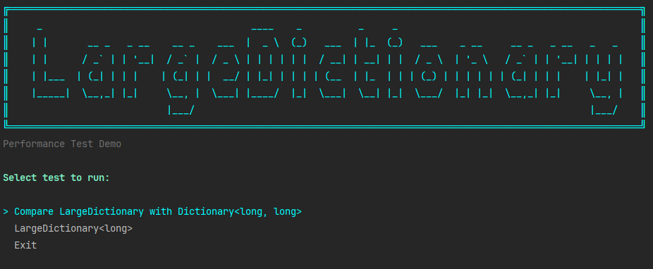
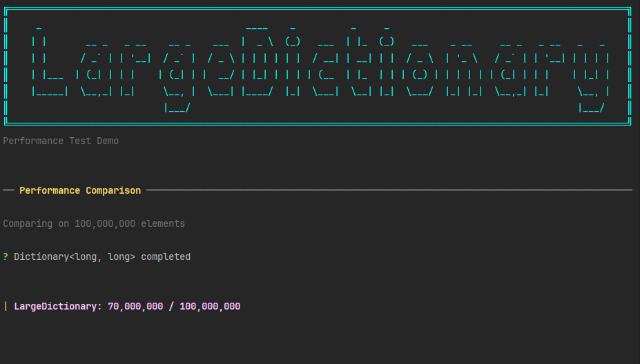
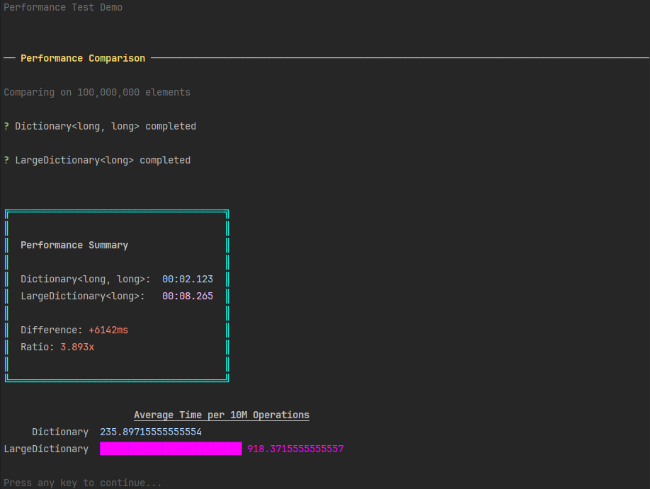
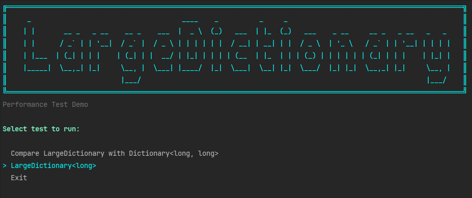
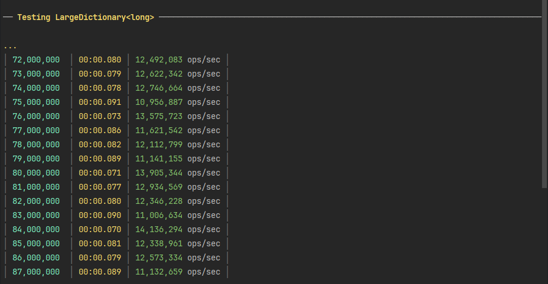
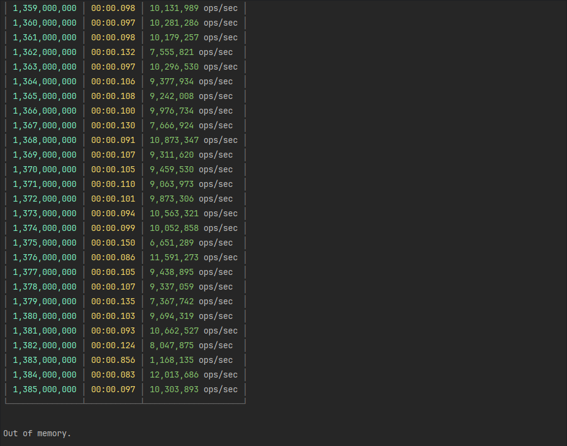

# R7 LargeDictionary - Результаты разработки

## Описание задачи

Создать словарь (`Dictionary`), который сможет хранить максимум 2 в 62 ключ-значений, в отличии от текущей реализации `Dictionary`.

## Рассмотренные варианты решения

### 1. MemoryMappedFile
**Идея:** Использование файлов, отображаемых в память, для хранения данных на диске с доступом через память.

**Преимущества:**
- Практически неограниченный объём хранения (ограничение по HD)
- Данные персистентны между запусками

**Недостатки:**
- Низкая производительность из-за операций ввода-вывода
- Сложность управления памятью
- Необходимость сериализации/десериализации данных

**Решение:** Отклонено из-за недостаточной производительности

---

### 2. Дерево с нодами
**Идея:** Иерархическая структура данных (например, B-Tree) для распределения элементов.

**Преимущества:**
- Хорошая балансировка данных
- Предсказуемая сложность операций O(log n)

**Недостатки:**
- Сложность реализации
- Overhead на хранение структуры дерева
- Не использует преимущества хеширования

**Решение:** Отклонено в пользу более простого и эффективного решения

---

### 3. Трёхуровневый шардированный словарь ✅
**Идея:** Разбиение 64-битного ключа на три части для создания иерархии из трёх уровней `Dictionary`.

**Преимущества:**
- Простота реализации
- Использование стандартных коллекций .NET
- Приемлемая производительность
- O(1) сложность операций (как в обычном Dictionary)

**Недостатки:**
- Ограничение памятью процесса
- Невозможность хранения данных между запусками

**Решение:** ✅ Выбрано для реализации

## Архитектура решения

### Битовое распределение ключей

64-битный ключ (`long`) разбивается на три части:
```
┌─────────────┬─────────────┬──────────────┐
│ Биты 43-63  │ Биты 22-42  │ Биты 0-21    │
│ (21 бит)    │ (21 бит)    │ (22 бита)    │
│ First Level │ Second Level│ Third Level  │
└─────────────┴─────────────┴──────────────┘

First Level:  2^21  = 2_097_152 возможных значений
Second Level: 2^21  = 2_097_152 возможных значений  
Third Level:  2^22  = 4_194_304 возможных значений

Теоретическая ёмкость: 2^64 элементов
Практическая ёмкость: Ограничена доступной памятью
```

### Основные компоненты

#### 1. `LargeDictionary<TValue>`
Главный класс, предоставляющий API, аналогичный стандартному `Dictionary`:
```csharp
public class LargeDictionary
{
    public long Count { get; }
    public TValue this[long key] { get; set; }
    
    public void Add(long key, TValue value);
    public bool TryAdd(long key, TValue value);
    public bool TryGetValue(long key, out TValue? value);
    public bool Remove(long key);
    public bool ContainsKey(long key);
    public void Clear();
    public TValue GetOrAdd(long key, TValue value);
    public bool TryRemove(long key, out TValue? value);
}
```

#### 2. `ThreeLevelShardingStrategyHandler<TValue>`
Реализация трёхуровневого хранения:

- **Первый уровень** (First Level): ~2M словарей
- **Второй уровень** (Second Level): ~2M словарей в каждом First Level
- **Третий уровень** (Third Level): ~4M элементов в каждом Second Level

#### 3. `CapacityLevelsCalculator`
Оптимизация выделения памяти на основе ожидаемого количества элементов:
```csharp
public CapacityDistribution CalculateCapacities(long capacity)
{
    // Расчёт capacity для каждого уровня
    // чтобы минимизировать реаллокации
}
```

## Результаты тестирования

### Тестовое окружение
- **Платформа:** .NET 8.0
- **Система:** Windows
- **Тестовый объём:** До 1,385,000,000 элементов

### Производительность

#### Сравнение с Dictionary<long, long> на 100,000,000 элементов
```
╭────────────────────────────────────────────────────────────╮
│                  Performance Summary                       │
│                                                            │
│  Dictionary<long, long>:    00:02.123                      │
│  LargeDictionary<long>:     00:08.265                      │
│                                                            │
│  Difference:                +6142ms                        │
│  Ratio:                     3.893x                         │
│                                                            │
╰────────────────────────────────────────────────────────────╯
```

**Выводы:**
- ✅ `LargeDictionary` успешно работает с объёмами > 100M элементов
- ⚠️ Производительность в ~3.9 раза ниже стандартного `Dictionary`
- ⚠️ Замедление связано с трёхуровневой структурой и множественными Dictionary lookup

#### Скорость операций
```
╭──────────────┬────────────────┬─────────────┬────────────────╮
│  Elements    │ Interval Time  │ Total Time  │  Performance   │
├──────────────┼────────────────┼─────────────┼────────────────┤
│  72,000,000  │ 00:00.080      │ 00:00:06    │ 12,492,083 o/s │
│  73,000,000  │ 00:00.079      │ 00:00:06    │ 12,622,342 o/s │
│  74,000,000  │ 00:00.078      │ 00:00:06    │ 12,746,664 o/s │
│  ...         │ ...            │ ...         │ ...            │
│ 1,380,000,000│ 00:00.103      │ 00:02:15    │  9,694,319 o/s │
│ 1,381,000,000│ 00:00.093      │ 00:02:15    │ 10,662,527 o/s │
│ 1,382,000,000│ 00:00.124      │ 00:02:15    │  8,047,875 o/s │
│ 1,383,000,000│ 00:00.836      │ 00:02:16    │  1,168,135 o/s │
│ 1,384,000,000│ 00:00.083      │ 00:02:16    │ 12,013,086 o/s │
│ 1,385,000,000│ 00:00.097      │ 00:02:16    │ 10,303,893 o/s │
╰──────────────┴────────────────┴─────────────┴────────────────╯
```

**Средняя производительность:** ~10-12 миллионов операций в секунду

### Ограничения

❌ Out of Memory на ~1.4 миллиарда элементов

## Покрытие тестами

### Unit-тесты

✅ **100% покрытие публичного API**

Протестированы:
- Все методы `LargeDictionary<TValue>`
- Все методы `ThreeLevelShardingStrategyHandler<TValue>`
- `CapacityLevelsCalculator`
- Граничные случаи (min/max long, null values)
- Стресс-тесты (до 1,000,000 операций в тестах)
```csharp
// Примеры тестов
[Fact] public void Add_NewKey_AddsSuccessfully()
[Fact] public void TryAdd_DuplicateKey_ReturnsFalseAndCountUnchanged()
[Fact] public void Indexer_Set_ExistingKey_UpdatesValue()
[Fact] public void Remove_ExistingKey_ReturnsTrueAndDecrementsCount()
[Fact] public void StressTest_ThousandOperations_WorksCorrectly()
```

---

## Примеры работы cli demo

### Начало работы:




### Выполнение Perfomance comapre теста






### Выполнение демонстрации работы LargeDictionary





